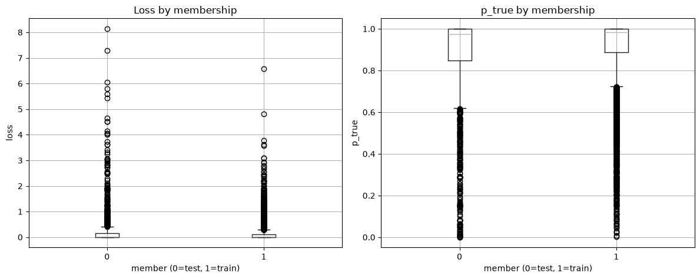
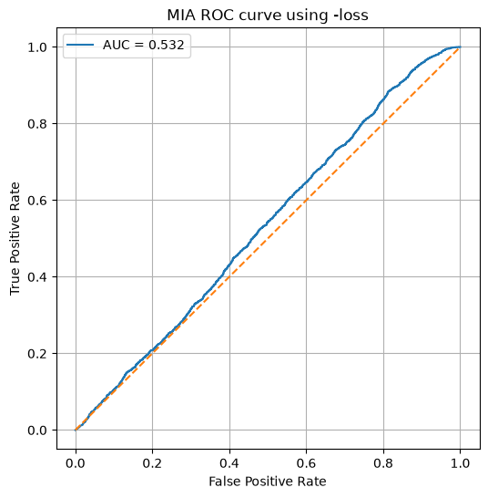
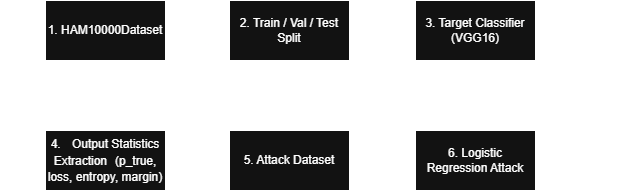

### 1. Membership inference attack (MIA)

I first trained several classifiers on the HAM10000Dataset to detect melanoma in the dataset. This Melanoma detection projet is on my Github here : [Melanoma Detection](https://github.com/valjentet/MelanomaDetection) 

To evaluate a possible privacy leakage of the image-based classifier VGG16, I implemented a **membership inference attack** (MIA).  
The objective is to determine whether a given sample was part of the target model training set, based only on the model output statistics.

This is an experimentation on personal data leak. Generally personnal data can't be found on dataset but with MIA we can associate 2 different sources and AI model needs to be compliant with GDPR requirements before public release. 


The complete attack dataset contains 8,513 samples and 7 columns:
- `member`: membership label (`1` for member, `0` for non-member),  
- `y_true`: true class label,  
- `p1`: predicted probability of class 1,  
- `p_true`: predicted probability assigned to the true label,  
- `loss`: per-sample loss,  
- `entropy`: entropy of the predictive distribution,  
- `margin`: difference between the highest and second-highest confidence.

The attack setting is therefore:
- **Members**: samples coming from the training set,  
- **Non-members**: samples coming from the test set.

A supervised attack model based on **logistic regression** was trained on the four main attack features:
- `p_true`,  
- `loss`,  
- `entropy`,  
- `margin`

### 2. Numerical analysis of attack features

A first observation is that the average feature values differ only slightly between members and non-members.

Average attack features:
- **Non-members** (`member = 0`)
  - `p_true = 0.863258`  
  - `loss = 0.253783`  
  - `entropy = 0.210315`  
  - `margin = 0.823199`

- **Members** (`member = 1`)
  - `p_true = 0.908289`  
  - `loss = 0.125118`  
  - `entropy = 0.191693`  
  - `margin = 0.845158`

These values show the expected direction:
- members have a higher average `p_true` (0.9083 vs 0.8633),  
- members have a lower average `loss` (0.1251 vs 0.2538),  
- members have a slightly lower average `entropy` (0.1917** vs 0.2103),  
- members have a slightly larger average `margin` (0.8452 vs 0.8232**)

However, these differences remain relatively small, which already suggests that the two groups are strongly overlapping in feature space.

### 3. MIA results

The attack performance was evaluated using a ROC curve and the corresponding AUC.  
In the final experiment, the supervised attack reached an AUC of about **0.52**, which is only slightly above random guessing (`0.50`)

This means that:
- the attack captures only a **weak membership signal**,  
- members and non-members are only marginally distinguishable,  
- the current model does not expose a strong privacy leakage under this attack formulation.



The ROC curve remains close to the diagonal, which is consistent with an attack that performs only slightly better than chance.

### 4. Example predictions

Some individual samples illustrate the confidence levels produced by the model.

Examples of **member** samples:
- `p_true = 0.987808`, `loss = 0.012267`, `entropy = 0.065848`, `margin = 0.975616`  
- `p_true = 0.999621`, `loss = 0.000379`, `entropy = 0.003366`, `margin = 0.999242`  
- `p_true = 0.997585`, `loss = 0.002418`, `entropy = 0.016963`, `margin = 0.995171`

Examples of **non-member** samples:
- `p_true = 0.987074`, `loss = 0.013010`, `entropy = 0.069052`, `margin = 0.974148`  
- `p_true = 0.940444`, `loss = 0.061403`, `entropy = 0.225744`, `margin = 0.880888`  
- `p_true = 0.837019`, `loss = 0.177909`, `entropy = 0.444581`, `margin = 0.674037`

These examples confirm that some non-members can also receive very confident predictions, which makes membership discrimination difficult.

### 5. Interpretation

Even though the target model is not perfectly generalized, the observed gap between members and non-members is not large enough to produce a strong and reliable membership inference attack.

In other words:
- the model behaves, on average, slightly more confidently on members;  
- but the overlap between both groups remains too important for a simple confidence-based attack to work well;  
- the leakage signal exists at most in a limited form in this setting.

### 6. Visualization of attack features

To better understand the weak attack performance, I also compared the distributions of the main attack features for members and non-members.



These plots suggest that:
- the two groups largely overlap,  
- no single feature is sufficient to separate members from non-members cleanly,  
- this overlap explains why the final attack AUC remains close to **0.52**.


### 7. Project Architecture




```text
AI-privacy-analysis

├── README.md
├── .gitignore
├── MIA_method/
│   ├── AI_Model/
│   │   └── cnn_vgg16_transfer_melanoma.keras
│   └── MIA_method.ipynb
├── images/
│   ├── mia_roc.png
│   ├── pipeline_overview.drawio.png
│   └── mia_features.png
├── HAM10000_Dataset/
│   ├── HAM10000_features_colors.csv
│   ├── HAM10000_metadata.csv
│   ├── HAM10000/
│   │   ├── ISIC_0024306.png
│   │   ├── ISIC_0024307.png
│   │   └── ...
│   ├── HAM10000_segmentations_lesion_tschandl/
│   │   ├── ISIC_0024306_segmentation.png
│   │   ├── ISIC_0024307_segmentation.png
│   │   └── ...

```